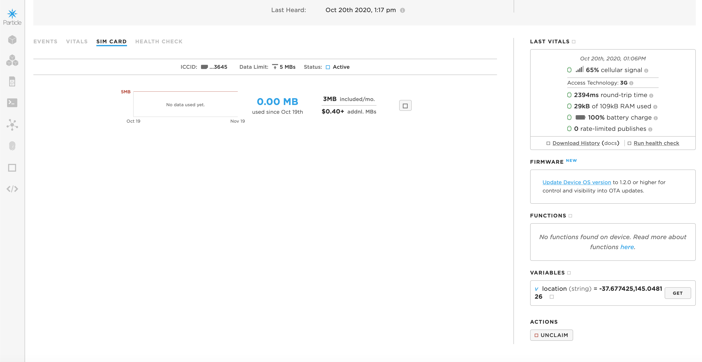

# Litter Hotspot Mapping System

## Overview
The Litter Hotspot Mapping System is a system designed to keep our cities and society clean while also putting an emphasis on the environment. Most of the street litter lying around on our streets end up in the oceans and tons of this stuff ends up in the ocean every year. Marine wildlife can then eat thse harmful plastics and other materials, killing them from the inside. To fix this problem, the source needs to be controlled first and that includes locating street litter hotspots in our community. With GPS trackers and other sensors attached to tongs (which pick up street litter), one can track where street litter hotspots are and enforce rules and advice of throwing litter in the bin, etc. Anyone can then access this data through a website or through a mobile app, allowing anyone to get involved. We want a cleaner, healthier planet.


## In Depth
### Checking when Street Litter is Picked Up
The module is this system is the sensors that check when street litter is picked up. There are two options to this - 

- Check when tongs are closed or
- Check when a specific gesture is done

If such a switch is triggered, then the module will notify a Particle Electron to get GPS Latitude and Longitude Coordinates.

### Getting GPS Coordinates

The Particle Electron (along with an attached GPS module) will record latitude and longitude coordinates when the switch above is triggered. The main parts of the code are - 

1. Setting up the GPS Tracker

```C

AssetTracker t = AssetTracker();
char latLong[25];

bool publishGPS = true;

void setup() {
    t.begin();
    t.gpsOn();
    Particle.variable("location", location);
}

```

2. Publishing location data to the Particle Cloud

```C 

location = t.readLatLon();
location.toCharArray(latLong, 25);

String dataString = String(location);
if (publishGPS == true){
    Particle.publish("gpsFix",dataString,60,PRIVATE);
    delay(500);

```

The image below shows the result that is seen (data is being published live to the Particle Cloud). Now the snippets of code above is not the entire thing, to find the entire code, use the link provided below - 

https://github.com/rudrathegreat/litter_picker/blob/main/code/GPS.c



## Features

- Currently got GPS tracking working

## Requirements

- Particle electron with GPS Module
- Implementation of C for Particle Electron

## Further Resources

https://docs.particle.io/quickstart/electron/

```Python

print('Thanks for Reading!')

```
